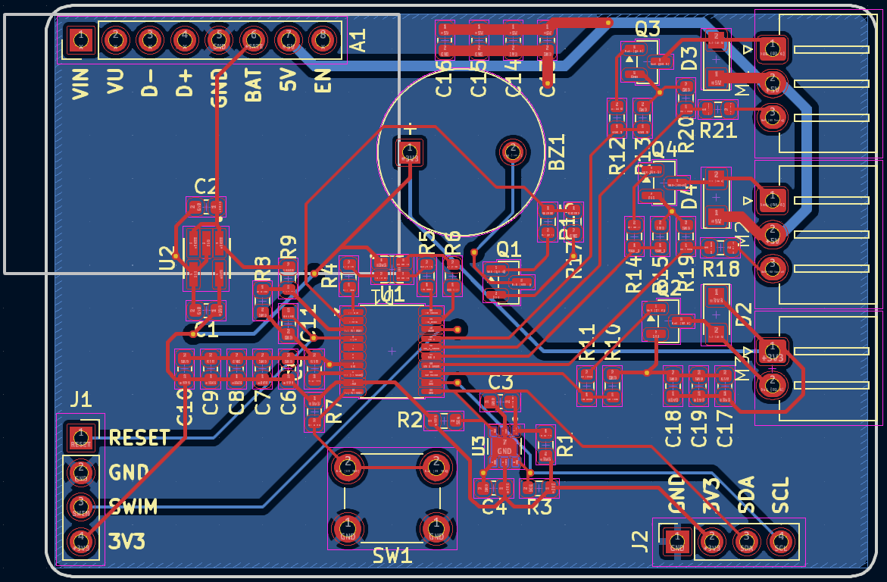
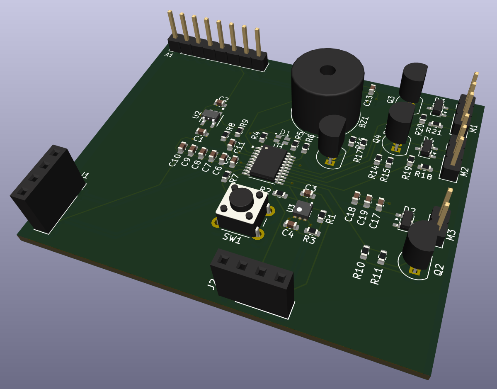
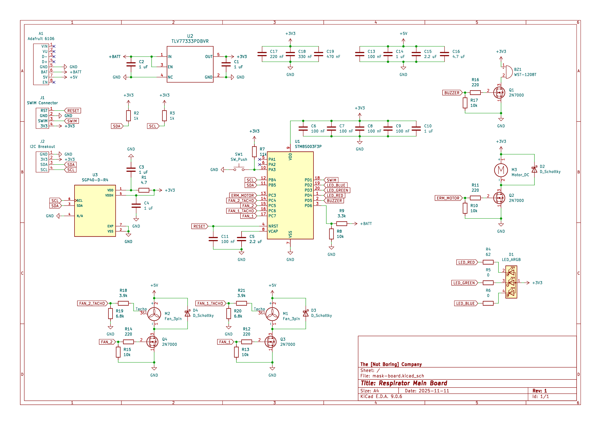

# Respirator Main Board PCB
## Description

Controls the fans of an active respirator, with added user interface and
various indicators. Made for Intro Engineering Design final project, Fall 2025.

## Pictures

Layout:

3D Render:

Schematic:

